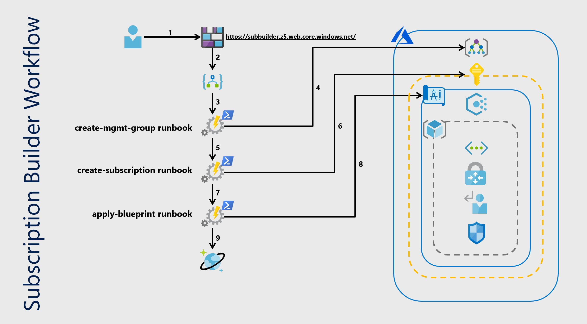

# Azure Subscription Builder

<!-- 
Guidelines on README format: https://review.docs.microsoft.com/help/onboard/admin/samples/concepts/readme-template?branch=master

Guidance on onboarding samples to docs.microsoft.com/samples: https://review.docs.microsoft.com/help/onboard/admin/samples/process/onboarding?branch=master

Taxonomies for products and languages: https://review.docs.microsoft.com/new-hope/information-architecture/metadata/taxonomies?branch=master
-->

The Azure Subscription Builder project allows an Enterprise Account owner to quickly deploy secure, policy compliant, Azure Subscriptions. The solution consists of a Front End HTTP trigger, a Logic App Workflow, Azure Automation Account/Runbooks, Blueprints, and CosmosDB. The front end passes variables to the Logic App workflow URI via HTTP Post, details are covered in a dedicated section below. Currently, a sample static web front end is defined as an option in this project. Since the solution leverages a RESTful HTTP trigger, you can bring your own front end such as a PowerApp or a Github Action. The Logic App then takes the variables and passes them as parameters when invoking a set of Azure Automation Runbooks. The first runbook called `create-mgmt-group` creates a management group (if it already does not exist) to place the subscriptions under. The second runbook called `create-subscription` creates the subscriptions and places them under the previously created management group. The last runbook called `assign-blueprint` assigns the desired blueprint to the newly created subscriptions. This helps to ensure that proper policy and governance is enforced on new subscriptions at the time of build.

## Contents

| File/folder       | Description                                |
|-------------------|--------------------------------------------|
| `blueprints/`      | A sample blueprint for deployment. You can bring your own.|
| `images/`          | Architecture design, example screenshots, and images for optional web frontend.|
| `infra_templates/` | ARM templates for infrastructure deployment.|
| `runbooks/`        | Azure Automation Runbooks leveraged by the tool.|
| `WebFrontEnd/`     | Optional web frontend.                     |
| `deploy.ps1`      | PowerShell script to deploy tool.          |
| `deployParams.json`| Deployment parameters used by `deploy.ps1` and `teardown.ps1`.          |
| `teardown.ps1`    | PowerShell script to decommission the tool. Makes testing and experimentation easy.|
| `.gitignore`      | Define what to ignore at commit time.      |
| `CHANGELOG.md`    | List of changes to the sample.             |
| `CONTRIBUTING.md` | Guidelines for contributing to the sample. |
| `README.md`       | This README file.                          |
| `LICENSE`         | The license for the sample.                |

## Prerequisites

To successfully deploy this project, it requires the user have the following:

- An existing EA Subscription
- EA Owner rights
- The ability for account owners to provision both production and dev/test subscription offer types
- PowerShell Core v 6.x (to facilitate development cross platform functionality)
    - **Must have Az.Blueprint Module Installed**
    - Documentation can be found here: [Add Az.Blueprint Module](https://docs.microsoft.com/en-us/azure/governance/blueprints/how-to/manage-assignments-ps#add-the-azblueprint-module)
- A pre-created root management group under the TenantRootGroup
- A pre-created PFX Certificate for the Service Principal
    - _examples for both Windows (PowerShell PKI Module), and Mac (OpenSSL), included in a dedicated section below_
- Front end of your choice
    - _specific requirements covered in a dedicated section below_

## Setup

### Creating a self signed certificate 
As part of this project you will need to have access to a certificate in PFX format. Below are examples on how to generate a self signed certificate with openssl (Mac) and PowerShell (Windows)

**With OpenSSL**
This is an example using openssl to create a private key and public certificate, good for 1 year. Those components can then be used to build the PFX file:
```
$ openssl req -x509 -newkey rsa:4096 -keyout privateKey.pem -out publicCert.pem -days 365
Generating a 4096 bit RSA private key
...............................................++
.......................++
writing new private key to 'privateKey.pem'
Enter PEM pass phrase:
Verifying - Enter PEM pass phrase:
-----
You are about to be asked to enter information that will be incorporated
into your certificate request.
What you are about to enter is what is called a Distinguished Name or a DN.
There are quite a few fields but you can leave some blank
For some fields there will be a default value,
If you enter '.', the field will be left blank.
-----
Country Name (2 letter code) []:US
State or Province Name (full name) []:Washington
Locality Name (eg, city) []:Seattle
Organization Name (eg, company) []:
Organizational Unit Name (eg, section) []:
Common Name (eg, fully qualified host name) []:automationCert
Email Address []:EXAMPLE@EMAIL.COM

$ openssl pkcs12 -export -out Cert.pfx -inkey privateKey.pem -in publicCert.pem 
Enter pass phrase for privateKey.pem:
Enter Export Password:
Verifying - Enter Export Password:
```
**With PowerShell PKI module**
This is an example using PowerShell PKI module to create a private key and public certificate, good for 1 year. Those components can then be used to build the PFX file.

*If you are running WindowsPowershell (v5.x)*

Simply install the PKI Client module and use the New-SelfSignedCertificate cmdlet to generate your self signed certificate:
```
PS C:\Users\jdoe> Install-Module PKI

PS C:\Users\jdoe> $cert = New-SelfSignedCertificate -CertStoreLocation Cert:\CurrentUser\My\ -Subject MyCertificate -KeySpec KeyExchange

PS C:\Users\jdoe>$pw = ConvertTo-SecureString -String "p@ssw0rd!" -Force -AsPlainText

PS C:\Users\jdoe>Export-PfxCertificate -cert "Cert:\CurrentUser\My\$($cert.Thumbprint)" -Password $pw -FilePath C:\temp\MyCertificate.pfx
```

*If you are running PowerShell Core*

You'll need to install the Windows Compatibility module in order to then install the PKI Client Module. Once that's done, all steps are the same.
```
C:\Users\jdoe> Install-Module WindowsCompatibility -Scope CurrentUser

C:\Users\jdoe> Import-WinModule PKI

C:\Users\jdoe> $cert = New-SelfSignedCertificate....
```
### Deployment variables

The variables necessary to deploy this infrastructure are located in `deployParams.json` file. 
Fill in the key value pairs and save before running `deploy.ps1`.

**Example Parameters:**
```
{
    "Name": "subbuilder",
    "location": "westus2",
    "rootManagementGroup": "GlobalRootGroup",
    "pfxCertPath": "/Users/jdoe/temp/test.pfx",
    "certPass": "passw0rd!"
}   
```

## Running the sample

### Steps to deploy infrastructure:

- Clone repo down to local machine
- Fill in your variable values in `deployParams.json` file, make sure to save
- Run `deploy.ps1` from project root

### Steps to tear down the deployment:
- Run `teardown.ps1` from project root
    - Script will use values from the `deployParams.json` file

### How to invoke the Logic App workflow

The Logic App trigger will accept an HTTP Post to the Logic App URL with the following payload schema:
```
{
    "method": "POST",
    "schema": {
        "properties": {
            "blueprintName": {
                "type": "string"
            },
            "businessUnit": {
                "type": "string"
            },
            "location": {
                "type": "string"
            },
            "devTestSubCount": {
                "type": "string"
            },
            "prodSubCount": {
                "type": "string"
            }
        },
        "type": "object"
    }
}
```
If you were to test with cURL or Postman, An example payload would look like the following:
```
[
    {
        "blueprintName": "myblueprint",
        "businessUnit": "mybusinessunit,
        "location": "westus2",
        "devTestSubCount": "3",
        "prodSubCount": "2"
    }
]
```
**NOTE: IF YOU CHOOSE NOT TO DEPLOY ONE OF THE SUBSCRIPTION OFFER TYPES (DEV/TEST OR PROD) _YOU NEED TO ENTER 0 FOR THE VALUE_**

### Optional web front end - hosted as static website in a blob container

We realize that some Subscription Builder users will want to bring their own front end trigger, allowing for endless customization and integrations. For those individuals, please continue on to the next section which covers the expected format for the body of the HTTP POST API call. 

For the individuals that are looking for a simpler solution we decided to include the option to create a front end trigger as part of the Subscription Builder deployment process. When running the `deploy.ps1` script, the user is asked if they would like to also deploy the optional front end (default is 'No'). If the user chooses '(Y)es', the Subscription Builder Website will be deployed and configured as part of the infrastructure deployment. If the user chooses '(N)o', then the deployment continues and no front end is configured.  The optional front end leverages the static website feature available with Azure Storage Accounts, documentation found [here](https://docs.microsoft.com/en-us/azure/storage/blobs/storage-blob-static-website). The Subscription Builder website consists of 3 files, those being:

- `webFormDynamic.html`
- `errorPage.html`
- `spring-cloud.jpg`

We dynamically generate the `webFormDynamic.html` file, connect the HTTP Trigger to the Logic App URL, and upload all 3 files to the Storage Account. This front end then presents a web page for users to input the required variables to run the Subscription Builder service. The user then will click on the `Submit` button, and they will be asked to verify their selections. If the user wants to continue, they will click on the `BUILD` button at which time the site will POST the required JSON payload to the Logic App endpoint.

#### Step By Step Instructions for Front End

**Step 1**
- Enter your values into the required form:


**Step 2**
- Click on the "Submit" button:


**Step 3**
- Review the selections you have made:


**Step 4**
- If you are happy with your selections, press the "BUILD" button
- If you would like to start over, press the "Cancel" button


**Successful Trigger**
- This is a successful trigger response:


**Failed Trigger**
- This is a failed trigger response:


## Key concepts

### So, what does this solution actually deploy?

The included deploy script, `deploy.ps1`, will build the following infrastructure:
- **Resource Group** 
    - You _can_ bring an existing resource group
    - Deployment will create a new resource group if one does not already exist
- **User Assigned Service Principal**
    - SP is granted owner rights to the EA and Root Management Group
    - The SP certificate and password are currently set to expire 6 months after creation of the Service Principal 
        - _Please adjust this lifecycle to fit your organizations requirements. Config requirements covered in dedicated section_
- **Azure Monitor Log Analytics Workspace**
    - Aggregating platform diagnostic logs and metrics
- **Azure KeyVault**
    - Storing Service Principal Secret
- **Azure Storage Account**
    - Blob container for Automation Runbooks
    - You also have the option to deploy a pre-configured static website front end
        - _detailed information covered in a dedicated section below_
- **Upload Repo Artifacts** 
    - Upload Runbooks to Azure Storage Account
    - Import and Publish the Blueprint from this repo if it is not already present in user defined root management group
- **Azure Automation Account**
    - ARM Template will import the required `Az` modules for Azure Automation from [PowerShell Gallery](https://www.powershellgallery.com/)
    - Import Runbooks from Storage account
    - Azure Automation Certificate, using pre-created PFX certificate
    - Azure Automation API Connection
        - Established with Service Principal credentials
- **Azure CosmosDB Account**
    - CosmosDB Account, SQL API DB, and Container for tracking lifecycle of requests
- **Logic App Workflow**
    - HTTP Post Trigger
    - Authenticated connection to the Azure Automation Account
    - Azure Automation Jobs triggering the following runbooks:
        - create-mgmt-group
        - create-subscription
        - apply-blueprint
    -  Authenticated using the Service Principal in the deploy script
    -  Build details logged to CosmosDB for record keeping and auditing

### Architecture and workflow




### Service Principal credential expiration
Until all Azure Services support Managed Identities we do have to worry about expiring credentials for Service Principals. The deploy script `deploy.ps1` sets the expiration date for the certificate and password for **6 months after the creation date**. You can see in the example below:
```
## Create new Azure Service Principal
Write-Output "Creating new Azure Service Principal"
$now = [System.DateTime]::Now
$6mofrmnow = $now.AddMonths(6) 
$sp = New-AzADServicePrincipal `
-DisplayName "$Name" `
-CertValue $Base64Value `
-StartDate $now `
-EndDate $6mofrmnow

## Add client Secret to SP
Write-Output "Creating Azure Service Principal client secret"
New-AzADAppCredential `
-DisplayName $sp.DisplayName `
-Password $certPass `
-StartDate $now `
-EndDate $6mofrmnow
```
You can alter the expiration date to suit your specific needs by modifying the `$6mofrmnow` variable. This automation will stop working if the credentials on the Service Principal expire.

### Security considerations
For the purpose of this proof of concept we have not integrated security into the Logic App being deployed as part of this workflow. The HTTP trigger is unauthenticated in this example, which is not secure and only recommended for testing. To use this service in a production deployment it is recommended to use one or more of the following methods to secure your Logic App endpoint:

- Generate Shared Access Signatures (SAS)
- Restrict Inbound IP Addresses
- Add Azure Active Directory OAuth, or other measure
    - leveraging Azure API Management

The following documentation from Azure walks though best practices on securing the HTTP Trigger: [Securing Logic Apps](https://docs.microsoft.com/en-us/azure/logic-apps/logic-apps-securing-a-logic-app#access-to-request-based-triggers)

**_IT IS RECOMMENDED TO USE AVAILABLE SECURITY CONTROLS IN A PRODUCTION DEPLOYMENT_**

## FAQ

**Why would I use Subscription Builder?**

Subscription Builder enables EA customers to provision secure and compliant Azure Subscriptions quickly and repeatably, all while maintaining control over the underlying environments. The best part is that it can be easily customized to support any organizations individual needs! Unlocking the possibility of quickly deploying anything from greenfield Azure landing zones to a single, policy compliant, Azure subscription.   

**What does the roadmap for Subscription Builder look like?**

The goal for Subscription Builder is to become the de facto standard for Subscription deployments in Azure. We want to provide CAF Compliant infrastructure on demand, allowing for endless customization for our customers. Eventually, the goal is for this project to become a single Blueprint that you apply to a management group and have this all automagically deployed for you. Here is what is top of mind for us:
- Prescriptive guidance and examples for endpoint security, AuthN and AuthZ, and least privileged access model within the infrastructure stack
- Working on getting this entire deployment packaged up into a single Blueprint.
- Tighter integration with Landing Zone deployments

**Who are the awesome people that built this??**

Tyler, Harvey, and Chris are just some PNW computer nerds with our heads always in the clouds!

**Want to know more about Azure Subscription Builder??**

Please make sure to to check out the official Azure Subscription Builder presentation available here:
- [Power Point Presentation](https://subbuilderstgacct.blob.core.windows.net/presentation/AzureSubscriptionBuilder.pptx)
- [PDF Document](https://subbuilderstgacct.blob.core.windows.net/presentation/AzureSubscriptionBuilder.pdf)

Also, feel free to reach out to subscriptionbuilder@microsoft.com with any questions or feedback!

## Contributing

This project welcomes contributions and suggestions.  Most contributions require you to agree to a
Contributor License Agreement (CLA) declaring that you have the right to, and actually do, grant us
the rights to use your contribution. For details, visit https://cla.opensource.microsoft.com.

When you submit a pull request, a CLA bot will automatically determine whether you need to provide
a CLA and decorate the PR appropriately (e.g., status check, comment). Simply follow the instructions
provided by the bot. You will only need to do this once across all repos using our CLA.

This project has adopted the [Microsoft Open Source Code of Conduct](https://opensource.microsoft.com/codeofconduct/).
For more information see the [Code of Conduct FAQ](https://opensource.microsoft.com/codeofconduct/faq/) or
contact [opencode@microsoft.com](mailto:opencode@microsoft.com) with any additional questions or comments.
